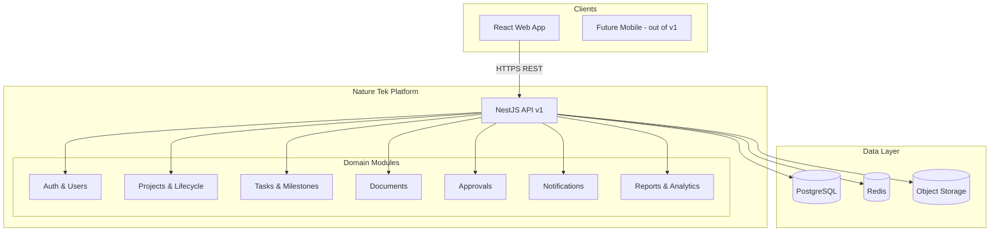
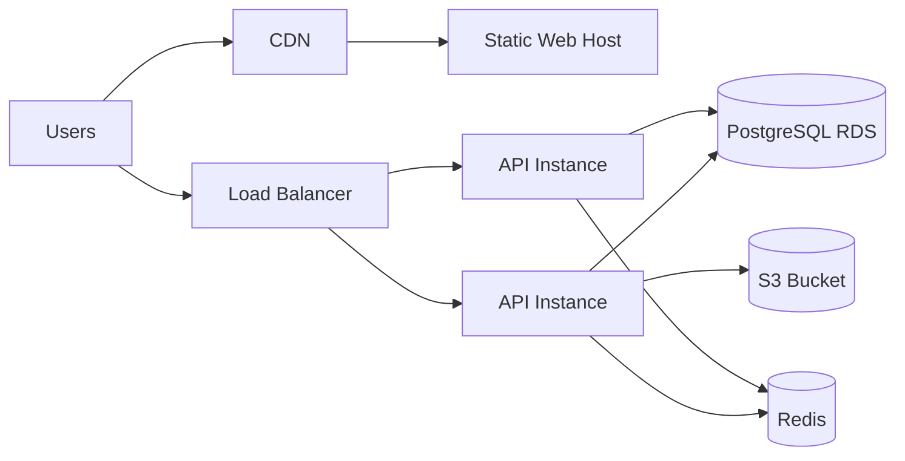

# System Architecture

## Nature Tek Solar – Project Tracking & Management System

| Document | Version | Date | Status |
|----------|---------|------|--------|
| Architecture & Technical Design | 1.0.0 | 2026-05-29 | Approved baseline (Step 1) |

---

## 1. What We Are Building (Phase 2)

A **modular monolith** delivered as a **pnpm monorepo** with:

- **React SPA** (`apps/web`) – role-based UI for PM, field, and admin users
- **NestJS API** (`apps/api`) – REST API v1, domain modules aligned to SRS §6
- **PostgreSQL** – system of record via Prisma (`packages/database`)
- **Shared package** – types, enums, Zod validators (`packages/shared`)
- **Docker Compose** – local Postgres, Redis, MinIO for development

Phase 2 establishes **structure, contracts, and data model**—not full feature implementation (Phase 3+).

---

## 2. Why This Architecture

| Decision | Rationale |
|----------|-----------|
| Modular monolith | Faster MVP than microservices; clear module boundaries for future extraction (NFR-SCALE-01) |
| TypeScript end-to-end | Type safety across API and UI (NFR-MAINT-01) |
| NestJS | Enterprise patterns: modules, guards, DI, testability; maps 1:1 to SRS domain modules |
| PostgreSQL | Relational integrity for projects, approvals, audit trails |
| Prisma | Schema-as-code, migrations, type-safe client |
| React + Vite | Fast dev experience, large talent pool, responsive field UI (NFR-UX-01) |
| Redis | Sessions, rate limits, notification queue (Phase 4+) |
| S3-compatible storage | Document scaling (NFR-SCALE-02, FR-DM-01) |

---

## 3. High-Level System Context



---

## 4. Application Layers

```
┌─────────────────────────────────────────────────────────────┐
│  Presentation (apps/web)                                     │
│  Pages → Features → Components → API Client (TanStack Query) │
└────────────────────────────┬────────────────────────────────┘
                             │ REST / JSON
┌────────────────────────────▼────────────────────────────────┐
│  API (apps/api)                                                │
│  Controllers → Services → Repositories (Prisma)                │
│  Guards: JwtAuth, Roles, ProjectAcl                            │
└────────────────────────────┬────────────────────────────────┘
                             │
┌────────────────────────────▼────────────────────────────────┐
│  packages/database (Prisma)  │  packages/shared (Zod/types) │
└────────────────────────────┬────────────────────────────────┘
                             │
                      PostgreSQL / S3 / Redis
```

### 4.1 Backend Module Map (NestJS)

| NestJS Module | SRS Module | Responsibility |
|---------------|------------|----------------|
| `AuthModule` | 1.1–1.2 | Login, JWT, refresh, MFA hook |
| `UsersModule` | 1.3 | User CRUD, invitations |
| `OrganizationsModule` | 1.3 | Org/branch settings |
| `ProjectsModule` | 2.x | Project CRUD, lifecycle state machine |
| `TasksModule` | 3.1–3.2 | Tasks, comments |
| `MilestonesModule` | 3.4 | Milestones |
| `ResourcesModule` | 4.x | People, materials, allocation |
| `DocumentsModule` | 5.x | Upload metadata, presigned URLs |
| `ApprovalsModule` | 6.x | Workflow instances |
| `NotificationsModule` | 7.x | In-app notifications |
| `ReportsModule` | 8.x | Report generation |
| `AnalyticsModule` | 9.x | KPI aggregations |
| `AuditModule` | 1.4 | Audit log writes |

### 4.2 Lifecycle State Machine

Implemented in `ProjectsModule` as `LifecycleService`:

- States = enum `ProjectLifecycleStage` (13 values, SRS §3)
- Transitions validated by `LifecycleTransitionPolicy`:
  - Required milestones complete
  - Required documents present
  - No blocking approvals
- All transitions → `LifecycleStageHistory` + `AuditLog`

---

## 5. Technology Stack

| Layer | Technology | Version policy |
|-------|------------|----------------|
| Runtime | Node.js | 20 LTS |
| Language | TypeScript | 5.x strict |
| Package manager | pnpm | 9.x |
| Monorepo | Turborepo | 2.x |
| Frontend | React, Vite, React Router | 18+/19 |
| UI | Tailwind CSS 4, Radix primitives | Design tokens in `packages/ui` (Phase 3) |
| Data fetching | TanStack Query | 5.x |
| Forms | React Hook Form + Zod | |
| Backend | NestJS | 10.x |
| ORM | Prisma | 5.x |
| Database | PostgreSQL | 16 |
| Cache | Redis | 7 |
| Files | MinIO (dev) / AWS S3 (prod) | |
| Auth | JWT access (15m) + refresh (7d) | MFA TOTP Phase 4 |
| API docs | OpenAPI 3.1 via `@nestjs/swagger` | Phase 3 |
| Testing | Vitest (web), Jest (api) | |
| CI | GitHub Actions (Phase 5) | |

---

## 6. Security Architecture

| Concern | Implementation |
|---------|----------------|
| Transport | TLS termination at reverse proxy (nginx/ALB) |
| Authentication | `POST /auth/login` → access + httpOnly refresh cookie |
| Authorization | Global `RolesGuard` + `ProjectAclGuard` on project routes |
| Passwords | bcrypt cost 12 |
| CSRF | SameSite cookies; CSRF token for cookie-based refresh |
| Input validation | Zod DTOs (shared schemas) at API boundary |
| File upload | Presigned POST to S3; virus scan hook (Phase 5) |
| Audit | `AuditLog` on lifecycle, approval, role changes |
| Secrets | `.env` / vault; never committed |

### 6.1 Project-Level ACL

User access to project if:

1. Global role `ADMIN`, or
2. Row in `ProjectMember` for that `projectId`

Field-level rules (e.g., `CLIENT` read-only) enforced in service layer.

---

## 7. Deployment Architecture (Target Production)



| Environment | Purpose |
|-------------|---------|
| `local` | Docker Compose, hot reload |
| `staging` | Pre-prod integration tests |
| `production` | HA API (2+ instances), managed DB, backups (NFR-AVAIL) |

---

## 8. Cross-Cutting Concerns

| Concern | Approach |
|---------|----------|
| Logging | Pino JSON, `x-correlation-id` header |
| Errors | RFC 7807 Problem Details |
| Pagination | Cursor-based for large lists; offset for admin |
| Idempotency | `Idempotency-Key` header on POST (approvals, stage advance) |
| Feature flags | `SystemSetting` table + env override |
| i18n | `react-i18next` structure in web (English v1) |

---

## 9. MVP vs Later Phases

| In MVP (Phase 3–4) | Deferred |
|--------------------|----------|
| Auth, users, RBAC (4 primary roles) | SSO (FR-UM-07) |
| Projects + lifecycle | Gantt chart (FR-ML-05) |
| Tasks, milestones | Task dependencies (FR-TM-05) |
| Documents upload | Full-text search (FR-DM-06) |
| Basic approvals (sequential) | Parallel approval chains |
| In-app + email notifications | SMS |
| Standard reports + CSV export | Custom report builder |
| Analytics dashboard (core KPIs) | ERP integration |

Extended roles (`DESIGN`, `PROCUREMENT`, etc.) modeled in DB; UI permissions phased in.

---

## 10. References

- SRS: `docs/01-requirement-analysis/SRS.md`
- Database: `docs/02-architecture/DATABASE-SCHEMA.md`
- API: `docs/02-architecture/API-DESIGN.md`
- Prisma schema: `packages/database/prisma/schema.prisma`

---

*End of Architecture Document – Phase 2*
