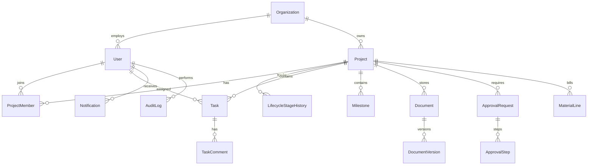

# Database Schema Design

## Nature Tek Solar PMS

Physical schema: `packages/database/prisma/schema.prisma`  
Database: **PostgreSQL 16**

---

## 1. Entity-Relationship Overview

---

## 2. Enumerations

| Enum | Values |
|------|--------|
| `SystemRole` | ADMIN, PM, SUPERVISOR, MEMBER, EXEC, DESIGN, PROCUREMENT, QA, FINANCE, CLIENT, SERVICE |
| `ProjectLifecycleStage` | 13 stages per SRS §3.1 |
| `ProjectStatus` | ACTIVE, ON_HOLD, COMPLETED, ARCHIVED |
| `TaskStatus` | NOT_STARTED, IN_PROGRESS, BLOCKED, IN_REVIEW, DONE, CANCELLED |
| `TaskPriority` | LOW, MEDIUM, HIGH, URGENT |
| `MilestoneStatus` | PENDING, IN_PROGRESS, COMPLETED, OVERDUE |
| `ApprovalType` | DESIGN, PROCUREMENT, QA, HANDOVER, STAGE_GATE, BUDGET, OTHER |
| `ApprovalStatus` | DRAFT, PENDING, APPROVED, REJECTED, CHANGES_REQUESTED |
| `ApprovalStepStatus` | PENDING, APPROVED, REJECTED, SKIPPED |
| `DocumentCategory` | SURVEY, DESIGN, PERMIT, PHOTO, TEST, HANDOVER, OTHER |
| `NotificationType` | TASK_DUE, MILESTONE_OVERDUE, APPROVAL_PENDING, STAGE_CHANGE, SYSTEM |
| `AuditAction` | CREATE, UPDATE, DELETE, LOGIN, STAGE_ADVANCE, APPROVE, REJECT |

---

## 3. Core Tables

### 3.1 Organization & Users

| Table | Purpose | Key columns |
|-------|---------|-------------|
| `organizations` | Tenant (Nature Tek v1 = single row) | `id`, `name`, `slug`, `settings` (JSON) |
| `users` | System users | `id`, `org_id`, `email`, `password_hash`, `role`, `is_active` |
| `refresh_tokens` | Session refresh | `id`, `user_id`, `token_hash`, `expires_at` |

**Indexes:** `users(email)` UNIQUE, `users(org_id, role)`

### 3.2 Projects & Lifecycle

| Table | Purpose | Key columns |
|-------|---------|-------------|
| `projects` | Solar project | `id`, `org_id`, `code`, `name`, `client_name`, `site_address`, `capacity_kw`, `type`, `current_stage`, `status`, `pm_id`, `supervisor_id`, `target_start`, `target_end` |
| `project_members` | Project team ACL | `project_id`, `user_id`, `project_role` |
| `lifecycle_stage_history` | Audit of stage changes | `project_id`, `from_stage`, `to_stage`, `changed_by`, `reason` |

**Indexes:** `projects(org_id, status)`, `projects(current_stage)`, `project_members(user_id)`

### 3.3 Work Management

| Table | Purpose |
|-------|---------|
| `tasks` | Work items: `project_id`, `stage`, `title`, `status`, `priority`, `due_at`, `assignee_id` |
| `task_comments` | Discussion on tasks |
| `milestones` | `project_id`, `stage`, `name`, `target_date`, `completed_at`, `status` |

### 3.4 Resources

| Table | Purpose |
|-------|---------|
| `material_lines` | BOM line per project: `sku`, `description`, `quantity`, `unit`, `status` |
| `resource_allocations` | User/equipment hours on project (Phase 4) |

### 3.5 Documents

| Table | Purpose |
|-------|---------|
| `documents` | Logical document: `project_id`, `category`, `title`, `required_for_stage` |
| `document_versions` | `storage_key`, `file_name`, `mime_type`, `size_bytes`, `version`, `uploaded_by` |

### 3.6 Approvals

| Table | Purpose |
|-------|---------|
| `approval_requests` | `project_id`, `type`, `status`, `title`, `requested_by` |
| `approval_steps` | Sequential steps: `order`, `approver_id`, `status`, `comment`, `acted_at` |

### 3.7 Notifications & Audit

| Table | Purpose |
|-------|---------|
| `notifications` | `user_id`, `type`, `title`, `body`, `entity_type`, `entity_id`, `read_at` |
| `audit_logs` | Polymorphic: `entity_type`, `entity_id`, `action`, `actor_id`, `metadata` (JSON) |

### 3.8 Configuration

| Table | Purpose |
|-------|---------|
| `stage_requirements` | Which documents/milestones required per stage (configurable) |
| `system_settings` | Key-value feature flags |

---

## 4. Lifecycle Rules (DB + Application)

| Rule | Enforcement |
|------|-------------|
| Single current stage | `projects.current_stage` column |
| History immutable | `lifecycle_stage_history` INSERT only |
| Terminal state | App blocks transition from `COMPLETED` except ADMIN |
| Soft delete | `projects.deleted_at`, `users.deleted_at` |

---

## 5. Migration Strategy

1. `prisma migrate dev` for local development  
2. Named migrations per feature slice in Phase 3  
3. Seed script: default org, admin user, stage requirements  

---

## 6. Performance Considerations

| Query pattern | Index |
|---------------|-------|
| Project list by org + status | `(org_id, status)` |
| My tasks | `(assignee_id, status)` |
| Pending approvals | `(approver_id, status)` on `approval_steps` |
| Notifications inbox | `(user_id, read_at)` |
| Analytics by stage | `(current_stage)` + materialized view (Phase 4) |

---

*See `schema.prisma` for authoritative field definitions.*
